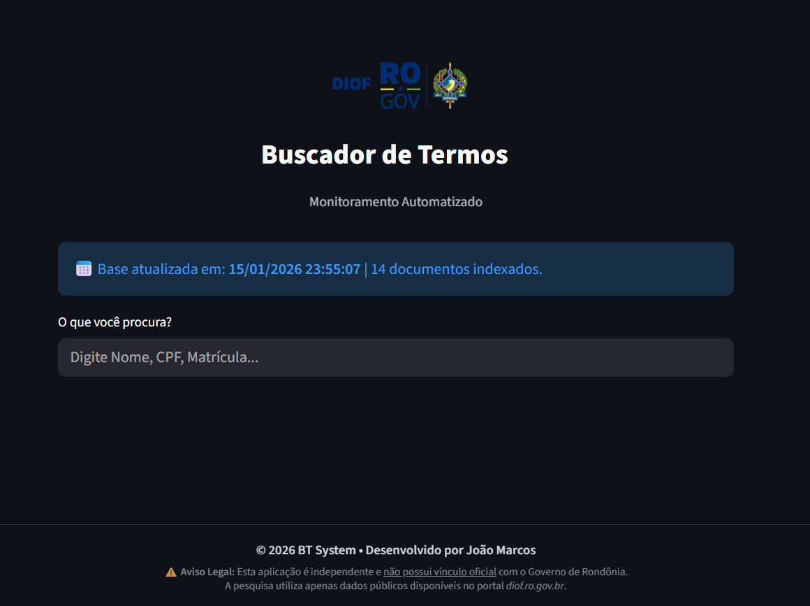

# ⚖️ Monitor DIOF-RO | Buscador de Termos


> **Acesse a aplicação online:** https://bt-diof-ro.streamlit.app/

## 🎯 Sobre o Projeto

O **Monitor DIOF-RO** é uma ferramenta desenvolvida para otimizar a pesquisa de termos (como nomes, CPFs, matrículas) no Diário Oficiai do Governo de Rondônia (https://diof.ro.gov.br/).

Diferente da busca tradicional, que exige o download manual de arquivos pesados, este sistema utiliza um **robô indexador** que varre o portal oficial periodicamente, processa os PDFs e cria uma base de dados otimizada. Isso permite buscas instantâneas (menos de 0.2s) e identifica exatamente em qual página o termo se encontra.

## 🚀 Funcionalidades

- **⚡ Busca Instantânea:** Pesquisa indexada via JSON, eliminando o tempo de download em tempo real.
- **📄 Localizador de Páginas:** Indica exatamente em quais páginas do PDF o termo aparece.
- **🔗 Deep Linking:** Botão "Abrir no local" que direciona para a página exata do PDF oficial.
- **📱 Mobile First:** Interface responsiva e adaptada para celulares.
- **🤖 Automação:** Atualização automática da base de dados via **GitHub Actions** (frequência horária).

## 📸 Screenshots


*Interface de busca com resultados detalhados e botões de ação.*

## 🛠️ Tecnologias Utilizadas

* **Frontend:** [Streamlit](https://streamlit.io/) (Interface Web)
* **Backend/Scraping:** Python (`requests`, `beautifulsoup4`, `pypdf`)
* **Automação:** GitHub Actions (CI/CD para execução do robô)
* **Database:** JSON (Flat-file database para alta performance de leitura)

## ⚙️ Como Executar Localmente

Se desejar rodar o projeto em sua máquina:

1.  **Clone o repositório:**
    ```bash
    git clone [https://github.com/SEU_USUARIO/monitor-diof-ro.git](https://github.com/SEU_USUARIO/monitor-diof-ro.git)
    cd monitor-diof-ro
    ```

2.  **Crie um ambiente virtual (opcional, mas recomendado):**
    ```bash
    python -m venv venv
    # Windows
    .\venv\Scripts\activate
    # Linux/Mac
    source venv/bin/activate
    ```

3.  **Instale as dependências:**
    ```bash
    pip install -r requirements.txt
    ```

4.  **Execute a aplicação:**
    ```bash
    streamlit run app.py
    ```

## 🔄 Arquitetura da Automação

O sistema funciona em um ciclo contínuo para garantir dados sempre frescos:

1.  **Agendamento:** O GitHub Actions dispara o script `coletor.py` a cada hora.
2.  **Coleta:** O script verifica novos PDFs no portal `diof.ro.gov.br`.
3.  **Processamento:** Se houver novidades, o PDF é baixado e o texto é extraído página a página.
4.  **Persistência:** Os dados são salvos em `dados.json` e o arquivo é "commitado" no repositório.
5.  **Deploy:** O Streamlit Cloud detecta a mudança no JSON e atualiza a interface automaticamente.

## ⚠️ Aviso Legal

Esta aplicação é uma iniciativa independente e de código aberto. **Não possui vínculo oficial** com o Governo do Estado de Rondônia. Todos os dados são públicos e obtidos através do portal de transparência do Diário Oficial.

## 👨‍💻 Autor

Desenvolvido por **João Marcos**.

[](https://www.linkedin.com/in/joaomarcos-engsoft/)
